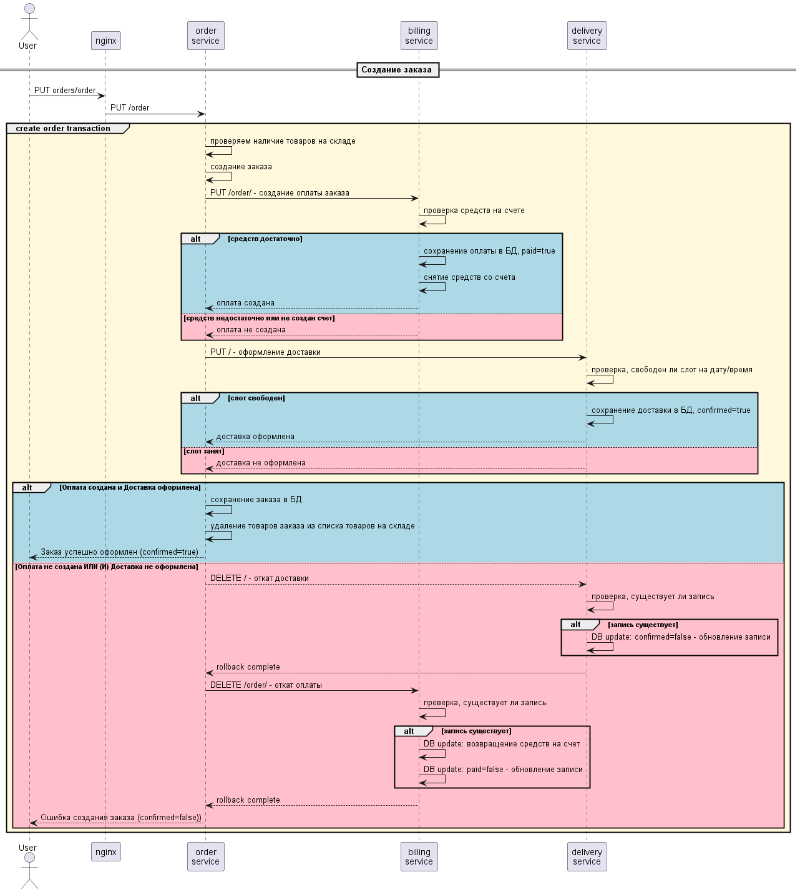

# Highload Homework 11 - Saga
### Сервисы приложения
- **auth-service** - сервис авторизации. Хранит UUID пользователей, их пароли и роли. Ответственность - login, signup и проверка аутентификации 
- **order-service** - сервис заказов. Хранит информацию о наличии товаров на складе, их цены и список заказов с их содержимым и статусами. Ответственность - склад, создание заказа.
- **delivery-service** - сервис доставки. Хранит информацию обо всех запрошенных доставках и их статусах. Ответственность - создание сетки заказов и поддержание согласованности заказо по времени
- **billing-service** - сервис оплаты. Хранит информацию о балансе пользователей и об оплатах заказов. Ответственность - пополнение баланса на счету пользователя, оплата заказов со счета пользователя, проедоставление актуальной информации о балансе и статусах оплат.

### Краткое описание взаимодействия сервисов 
Создание заказа возможно только для зарегистрированных и залогиненых пользователей. Запрос создания заказа отправляется на order-service, где открывается транзакция. В процессе создания заказа отправляются запросы на billing-service и delivery-service о создании оплаты и оформлении доставки на конкретный слот времени. Если что-то пошло не так, то созданные оплаты и доставки в этих сервисах откатываются дополнительными запросами (компенсирующие транзакции). На стороне order-service транзакиця просто завершается неудачей. Смотрите sequence диаграмму ниже. <br/>


### Упрощенная sequence диаграмма создания заказа на основе паттерна SAGA. 
Проверки авторизации, действия для поддержки идемпотентности и другое, не относящееся напрямую к SAGA, на данной диаграмме не отражено.


При разделении микросервисов предполагаются разные БД, но в задании была использована одна и та же база данных для упрощения. Таблицы разных сервисов не имеют взаимосвязанных constraints и независимы друг от друга. </br><br/>
Запросы **/auth** Nginx-ом перенаправляются на сервис авторизации, где пользователь может зарегистрироваться /signup и залогиниться /login.  <br/>
</br>
Запросы **/orders** перенаправляются в сервис заказов. Этот сервис принимает запросы с JWT аутентификацией только для зарегистрированных и залогиненых юзеров. Сервис заказов принимает следующие API запросы:
- GET /warehouse - посмотреть наличие товаров на складе.
- PUT /order - создать заказ. В теле запроса необходимо перечислить товары, их количество и указать дату и временной слот доставки. В случае отсутвия необходимой суммы на балансе пользователя или указании таймлота, который уже занят другим заказом происходит откат заказа, оплаты и доставки.
- GET /order/{orderUUID} - посмотреть заказ. Статус заказа возвращается в поле confirmed со значенияма true, если заказ прошел и false, если не прошел.</br>

Запросы **/billing** перенаправляются на сервис биллинга. Все запросы должны содержать токен аутентификации

- PUT / - добавить денег на счет
- GET /balance - посмотреть сколько денег на счету
- PUT /order - создание оплаты заказа. При наличии необходимой суммы, создается запись в таблице orders c paid=true и со счета списывается необходимая сумма. При отсутвии необходимой суммы записи не создается и происходит откат заказа.
- DELETE /order - откат оплаты заказа. Выставляется paid=false в таблице orders и на баланс возвращаются деньги
- GET /order - посмотреть оплату заказа. В поле orderStatus будет значение PAID в случае успешного оформления заказа и REJECTED в случае отката ранее оформленного заказа.

Запросы **/delivery** перенаправляются на сервис доставки. Все запросы должны содержать токен аутентификации

- PUT / - оформление доставки. При наличии свободного слота на дату/время, создается запись в таблице delivery с confirmed=true. При занятом слоте записи не создается и происходит откат заказа.
- DELETE / - откат доставки заказа. Выставляется confirmed=false в таблице delivery для ранее оформленной доставки
- GET / - посмотреть доставку заказа. В поле deliveryStatus будет значение CONFIRMED в случае успешного оформления доставки и REJECTED в случае отката ранее оформленной доставки.

### Краткое описание тестового сценария
- регистрация пользователя
- логин пользователя
- создаем заказ_1 стоимостью 2600 ==> не создан, нет счета
- убеждаемся, что оплата не создана
- убеждаемся, что доставка создана, но не подтверждена (была компенсирующая транзакция)
- убеждаемся, что заказ создан, но не подвержден
- добавляем 5000 на баланс
- создаем заказ_1 (повторный запрос) стоимостью 2600 ==> создан успешно
- убеждаемся, что на балансе осталось 2400
- убеждаемся, что заказ подтвержден
- убеждаемся, что оплата прошла
- убеждаемся, что доставка оформлена
- убеждаемся, что на складе товаров стало меньше на количество в заказе
- создаем заказ_2 (повторный запрос) ==> заказ не создан, не хватает средств и занят слот доствки
- добавляем 5000 на баланс
- на счету 7400
- создаем заказ 3 (новый запросб слот доставки изменен) ==> создан успешно
- убеждаемся, что на балансе осталось 4800
- убеждаемся, что заказ подтвержден
- убеждаемся, что оплата прошла
- убеждаемся, что доставка оформлена
- убеждаемся, что на складе товаров стало меньше на количество в заказе

### Запуск проекта
- Из корневой директории запускаем файл докер-компоуз. Иногда тот или иной контейнер не стартует из-за проблем с присоединением к БД. В таком случае его нужно перезапустить.
```bash
docker-compose up
```

### Тестирование
- Вариант 1 - импортируем коллекцию запросов `hl-hw-11_saga.localhost.80.postman.json` из корня проекта в Postman и запускаем коллекцию
- Вариант 2 - newman-ом запускаем postman коллекцию `hl-hw-11_saga.localhost.80.postman.json`:
```bash
newman run hl-hw-11_saga.localhost.80.postman.json
```
#### (*) Для повторного запуска тестов необходимо почистить БД поскольку таймслоты доставки захардкожены в сценариях и не могут использоваться повторно
- Всем записям в таблице delivery с confirmed=true выставляем confirmed=false (освобождаем таймслоты)
